<a href="https://rramos.dev">
  <picture>
    <source media="(prefers-color-scheme: dark)" srcset="./assets/header-dark.svg" />
    <source media="(prefers-color-scheme: light)" srcset="./assets/header-light.svg" />
    
  </picture>
</a>

 

I design and build complete digital products, from the data model to the interface, and take them all the way to production.

I started programming on my own and never stopped. Today I work across every layer of a product: database, API, interface and infrastructure, almost always in TypeScript end to end. Alongside my degree, I build my own projects, always chasing the same thing: software that is simple to use, fast and dependable.

**[rramos.dev](https://rramos.dev)** &nbsp;·&nbsp; [hello@rramos.dev](mailto:hello@rramos.dev) &nbsp;·&nbsp; [LinkedIn](https://www.linkedin.com/in/rodrigoqcramos) &nbsp;·&nbsp; [X](https://x.com/rqcramos)

 

<picture>
  <source media="(prefers-color-scheme: dark)" srcset="./assets/stack-dark.svg" />
  <source media="(prefers-color-scheme: light)" srcset="./assets/stack-light.svg" />
  
</picture>
