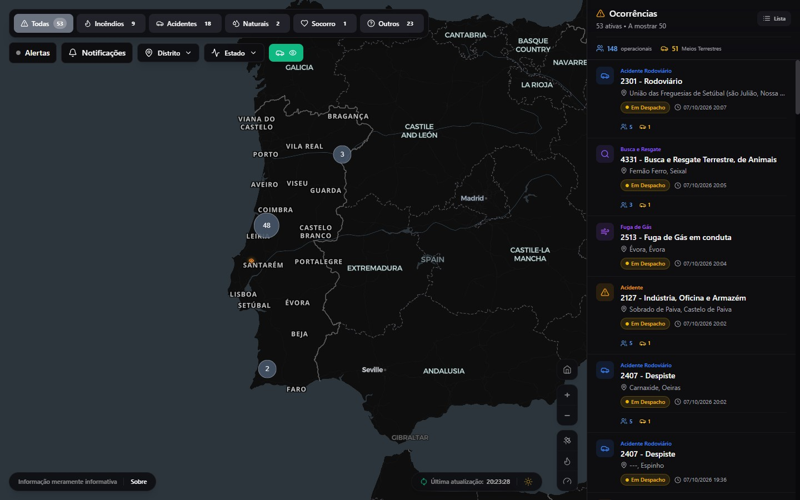

<a href="https://rramos.dev">
  <picture>
    <source media="(prefers-color-scheme: dark)" srcset="./assets/header-dark.svg" />
    <source media="(prefers-color-scheme: light)" srcset="./assets/header-light.svg" />
    
  </picture>
</a>

 

I design and build complete digital products, from the data model to the interface, and take them all the way to production.

I started programming on my own and never stopped. Today I work across every layer of a product: database, API, interface and infrastructure, almost always in TypeScript end to end. Alongside my degree, I build my own projects, always chasing the same thing: software that is simple to use, fast and dependable.

**[rramos.dev](https://rramos.dev)** &nbsp;·&nbsp; [hello@rramos.dev](mailto:hello@rramos.dev) &nbsp;·&nbsp; [LinkedIn](https://www.linkedin.com/in/rodrigoqcramos) &nbsp;·&nbsp; [X](https://x.com/rqcramos)

 

### Selected work

**[EmCurso.PT](https://emcurso.pt)** &nbsp;2026 
Civil-protection platform for Portugal: live ANEPC incidents, IPMA weather warnings and wildfire risk on an interactive map. 
Next.js · MapLibre · PostgreSQL

 

<a href="https://api.emcurso.pt">
  <picture>
    <source media="(prefers-color-scheme: dark)" srcset="./assets/api-dark.svg" />
    <source media="(prefers-color-scheme: light)" srcset="./assets/api-light.svg" />
    
  </picture>
</a>

**[API.EmCurso.PT](https://api.emcurso.pt)** &nbsp;2026 
Public REST API serving ANEPC incidents, IPMA alerts and fire-risk data as JSON and GeoJSON, refreshed within 30 seconds of the source. 
Next.js · TypeScript · PostgreSQL · GeoJSON

 

| Project | Year | What it is | Built with |
| :-- | :-- | :-- | :-- |
| **Management dashboard** | 2025 | A custom internal dashboard for seeing everything that matters on one screen. | React, TypeScript, PostgreSQL |
| **LinceAPI** | 2023 | A scalable API for data processing. | Next.js, Web3, PostgreSQL, Tailwind |
| **TrackIt** | 2023 | High-performance tracking for logistics and deliveries. | Node, PostgreSQL, Docker |

Internal projects, no public access.

 

### Stack

<picture>
  <source media="(prefers-color-scheme: dark)" srcset="./assets/stack-dark.svg" />
  <source media="(prefers-color-scheme: light)" srcset="./assets/stack-light.svg" />
  
</picture>

 

### Right now

- Building **EmCurso.PT** and its public API.
- Open to projects, collaborations or a conversation about technology. Write to **[hello@rramos.dev](mailto:hello@rramos.dev)**.

 

&nbsp; Made in Portugal &nbsp;·&nbsp; © 2026 Rodrigo Ramos
